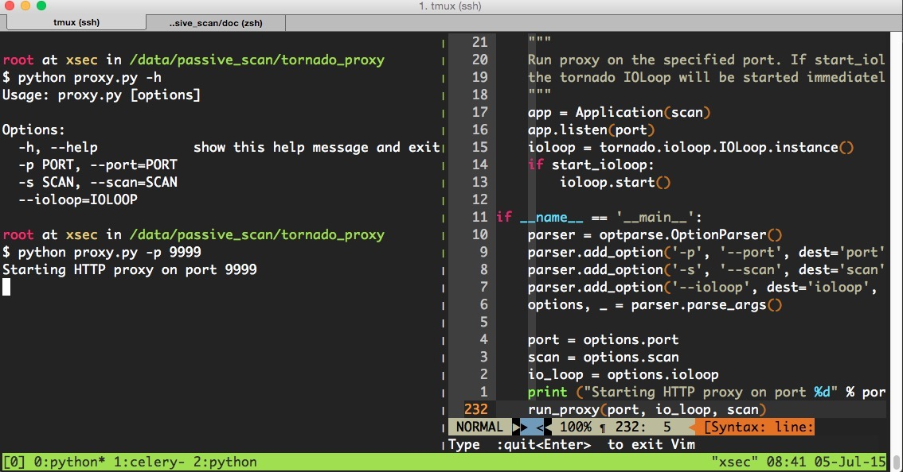
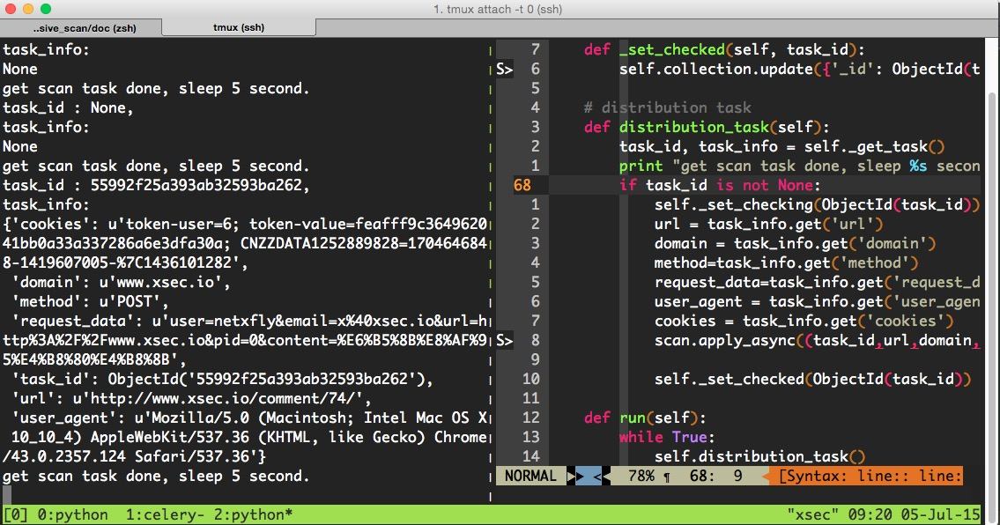

.. highlight:: python
    :linenothreshold: 0

.. 如何实现一个基于代理的web扫描器 documentation master file, created by netxfly <x@xsec.io>
   sphinx-quickstart on Sun Jul  5 19:11:18 2015.
   You can adapt this file completely to your liking, but it should at least
   contain the root `toctree` directive.

如何实现一个基于代理的web扫描器
======================================

概述
--------------------------------

.. note::
    在WEB业务上线前，QA测试阶段，可将QA的浏览器代理设到一个指定的代理中或测试pc拨入特定的vpn中，QA在测试功能的同时，
    安全测试也会在后台同步完成，其好处不言而喻。

该类扫描器常见的有2种：

1. 代理式
2. vpn + 透明代理

.. note:: 本文只讲第1种，第2种的实现方式稍麻烦一些，一天半天的时间内写不出来，留在下篇文章中写。

架构说明
-------------------------------
.. image:: proxy.png

proxy模块的实现
-------------------------------

用户请求数据抓取
~~~~~~~~~~~~~~~~~~~

proxy模块是在开源项目 ``https://github.com/senko/tornado-proxy`` 的基础上改的，将用户的请求与服务器的响应数据过滤后存入了mongodb中。
我新加的代码在30 - 38行之间。
::

    class ProxyHandler(tornado.web.RequestHandler):
        SUPPORTED_METHODS = ['GET', 'POST', 'CONNECT']

        @tornado.web.asynchronous
        def get(self):
            url_info = dict(
                method=self.request.method,
                url=self.request.uri
            )
            self.request_info = None

            def handle_response(response):
                if (response.error and not
                        isinstance(response.error, tornado.httpclient.HTTPError)):
                    self.set_status(500)
                    self.write('Internal server error:\n' + str(response.error))
                else:
                    self.set_status(response.code)
                    for header in ('Date', 'Cache-Control', 'Server','Content-Type', 'Location'):
                        v = response.headers.get(header)
                        if v:
                            self.set_header(header, v)
                    v = response.headers.get_list('Set-Cookie')
                    if v:
                        for i in v:
                            self.add_header('Set-Cookie', i)
                    if response.body:
                        self.write(response.body)

                # Insert http request  and response into mongodb
                if self.application.scan:
                    url = url_info.get('url')
                    url_filter = UrlFilter(url)
                    if url_filter.filter():
                        http_info = HttpInfo(url_info, self.request_info, response)
                        values = http_info.get_info()
                        mongodb = Mongodb(db_info)
                        mongodb.insert(values)

                self.finish()

            body = self.request.body
            self.request_info = self.request
            if not body:
                body = None
            try:
                fetch_request(
                    self.request.uri, handle_response,
                    method=self.request.method, body=body,
                    headers=self.request.headers, follow_redirects=False,
                    allow_nonstandard_methods=True)

            except tornado.httpclient.HTTPError as e:
                if hasattr(e, 'response') and e.response:
                    handle_response(e.response)
                else:
                    self.set_status(500)
                    self.write('Internal server error:\n' + str(e))
                    self.finish()

程序使用方法
~~~~~~~~~~~~~~~~~~

.. note:: 代码比较占篇幅，这里不贴了，请参考我的github： `https://github.com/netxfly/passive_scan` 。

proxy有2个参数:

1. port，端口不指定的话，默认为8088
2. scan，scan默认为true，表示会将用户信息入库，如果单纯只想作为一个代理，传入false即可。

任务分发模块
---------------
.. note:: 任务分发模块会定期检查mongodb中的待扫描列表，根据status字段判断是否有扫描任务，如果有扫描任务就分发给celery的worker执行。

1. status = 0，表示待扫描
2. status = 1，表示正在扫描
3. status = 2，表示扫描已完成

::

    # -*- coding: utf-8 -*-
    __author__ = 'Hartnett'

    import time
    from pprint import pprint
    import pymongo
    from bson.objectid import ObjectId

    from config import db_info
    from scan_tasks import scan

    class Scheduler(object):
        def __init__(self, interval=5):
            self.interval = interval
            self.db_info = db_info

            # connect to database
            self.client = pymongo.MongoClient(self.db_info.get('host'), self.db_info.get('port'))
            self.client.security_detect.authenticate(
                self.db_info.get('username'),
                self.db_info.get('password'),
                source='passive_scan'
            )

            self.db = self.client["passive_scan"]
            self.collection = self.db['url_info']

        def _get_task(self):
            task_id = None
            task_info = None
            tasks = self.collection.find({'status' : 0}).sort("_id", pymongo.ASCENDING).limit(1)
            for task in tasks:

                url = task.get('url')
                task_id = task.get('_id')
                domain = task.get('domain')
                method = task.get('request').get('method')
                request_data = task.get('request').get('request_data')
                user_agent = task.get('request').get('headers').get('User-Agent')
                cookies = task.get('request').get('headers').get('Cookie')
                task_info = dict(
                    task_id=task_id,
                    url=url,
                    domain=domain,
                    method=method,
                    request_data=request_data,
                    user_agent=user_agent,
                    cookies=cookies
                )

            print("task_id : %s, \ntask_info:") % task_id
            pprint(task_info)
            return task_id, task_info

        # set task checking now
        def _set_checking(self, task_id):
            self.collection.update({'_id': ObjectId(task_id)}, {"$set" : {'status' : 1}})

        # set task checked
        def _set_checked(self, task_id):
            self.collection.update({'_id': ObjectId(task_id)}, {"$set" : {'status' : 2}})

        # distribution task
        def distribution_task(self):
            task_id, task_info = self._get_task()
            print "get scan task done, sleep %s second." % self.interval
            if task_id is not None:
                self._set_checking(ObjectId(task_id))
                url = task_info.get('url')
                domain = task_info.get('domain')
                method=task_info.get('method')
                request_data=task_info.get('request_data')
                user_agent = task_info.get('user_agent')
                cookies = task_info.get('cookies')
                scan.apply_async((task_id,url,domain,method,request_data,user_agent,cookies,))

                self._set_checked(ObjectId(task_id))

        def run(self):
            while True:
                self.distribution_task()
                time.sleep(self.interval)

    if __name__ == '__main__':
        scheduler = Scheduler()
        scheduler.run()

扫描任务执行模块
----------------------------

.. note::

    任务扫描模块是利用celery实现分布式扫描的，可以将worker部署在多台服务器中，后端的扫描器大家根据实现情况加，比如wvs，arachni，wvs或自己写的扫描器
    ，这篇文章的重点在于代理扫描，我图方便就用了 `arachni` 。

::

    # -*- coding:utf8 -*-
    __author__ = 'hartnett'
    from celery import Celery
    from arachni import arachni_console

    from config import BACKEND_URL, BROKER_URL, db_info
    from helper import Reporter, PassiveReport, TaskStatus

    app = Celery('task', backend=BACKEND_URL, broker=BROKER_URL)

    # scanning url task
    # --------------------------------------------------------------------
    @app.task
    def scan(task_id, task_url,domain,method,request_data,user_agent,cookies):
        if task_url:
            print "start to scan %s, task_id: %s" % (task_url, task_id)
            scanner = arachni_console.Arachni_Console(task_url, user_agent, cookies,page_limit=1)
            report = scanner.get_report()
            if report:
                reporter = Reporter(report)
                value = reporter.get_value()
                if value:
                    # 如果存在漏洞则记录到数据库中
                    scan_report = PassiveReport(db_info, value)
                    scan_report.report()

            task_status = TaskStatus(db_info)
            # 将状态设为已扫描
            task_status.set_checked(task_id)

web管理后台
--------------------------

.. note:: 实现这个demo用了半天时间，写web后台还要处理前端展示，比较麻烦，所以没写，只讲下基于proxy的扫描器的实现思路。
